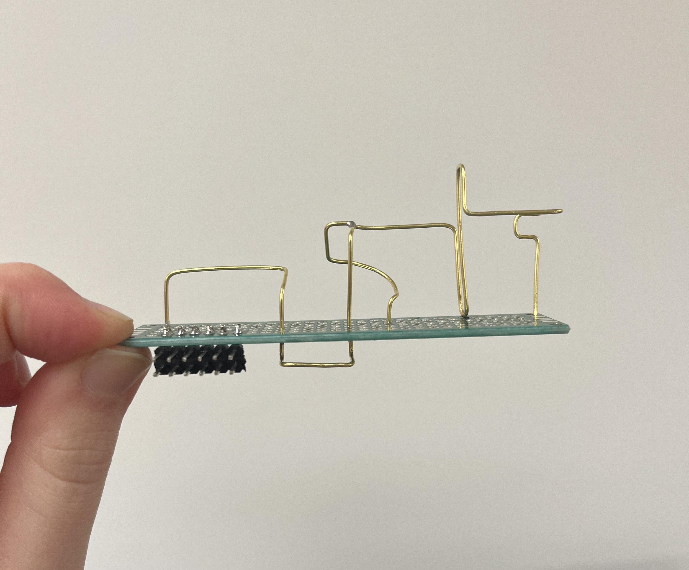
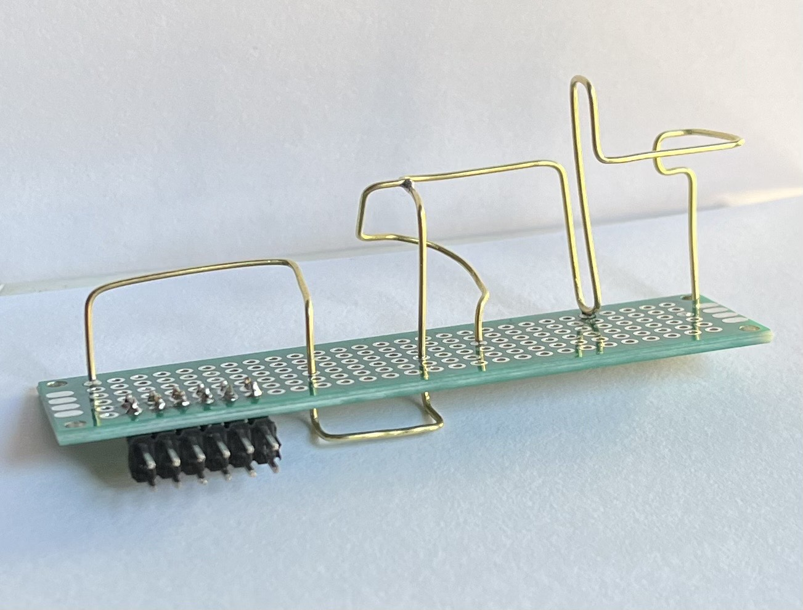
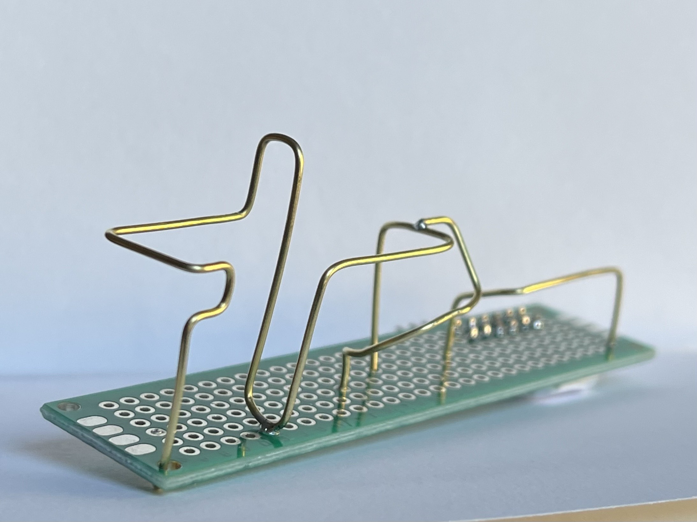
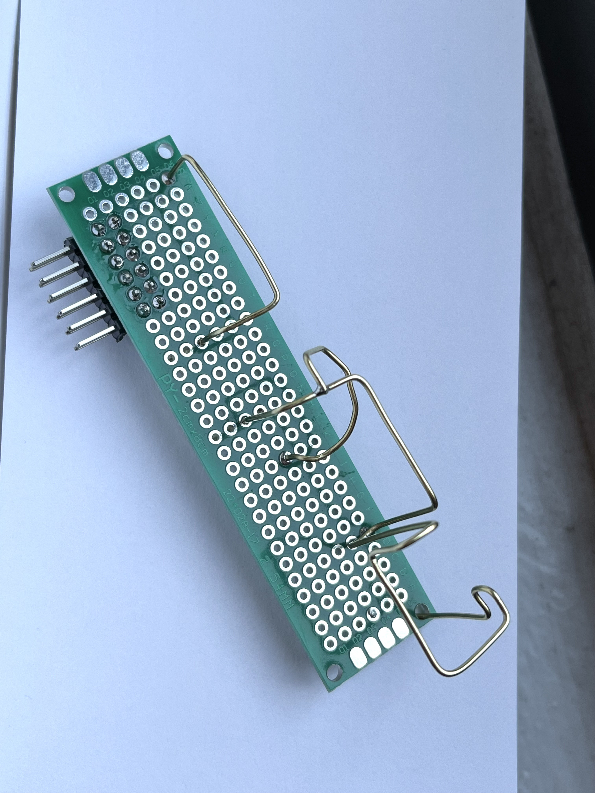

# PCB Fish Pendant
Flashing LED circuit on Printed Circuit Board
 

 
 
My biggest decision was what the outline would be. I wanted something with a simple recognizable silhouette. A fish came to mind at the last minute and I drew the outline myself on KiCad. I wanted to make use of the blinking light and integrate it into the shape so I made it the eye of the fish. Because of the layout of my circuit I was able to do that.
 
 

 
 
I imagined my fish hanging on the wall of my bedroom in darkness, like the deep ocean. Something quiet and calm. So I wanted a slower blink to go along with that. Something to let you know the fish was alive.
 
 

Hello

 
 
# Riverside
Soldering exercise. 12 pins and copper wire sculpture on protoboard.

I began this sculpture with no intention of what it was going to be. But as I made the first two bends starting from the corner of the board, I was reminded of the shape of my grandparents old house. So I continued, imagining and forming the contours of the building. Even though the wire creates only a skeleton of the house, I see the essence of the house in my sculpture. 

 

