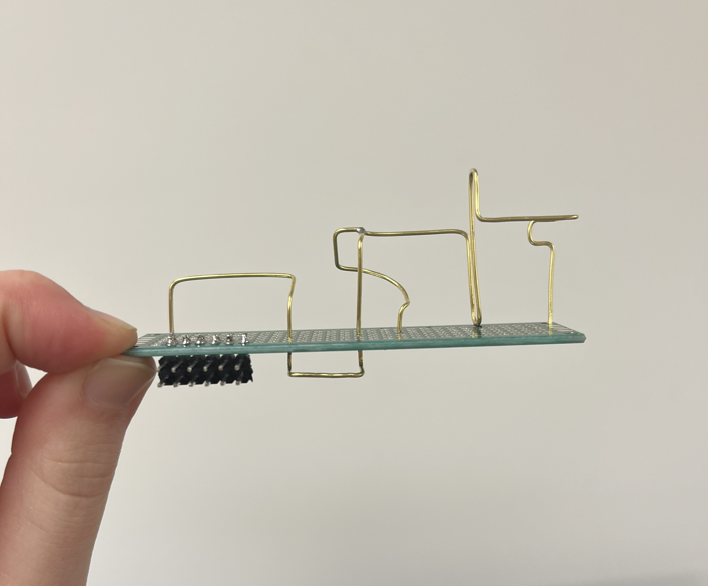
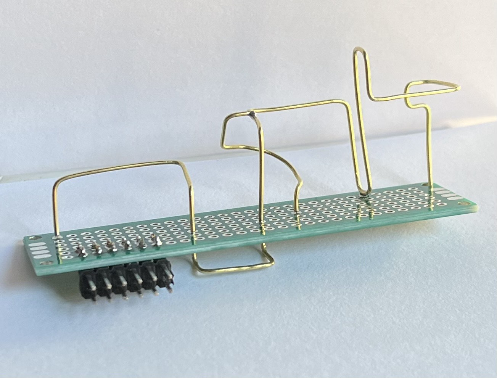
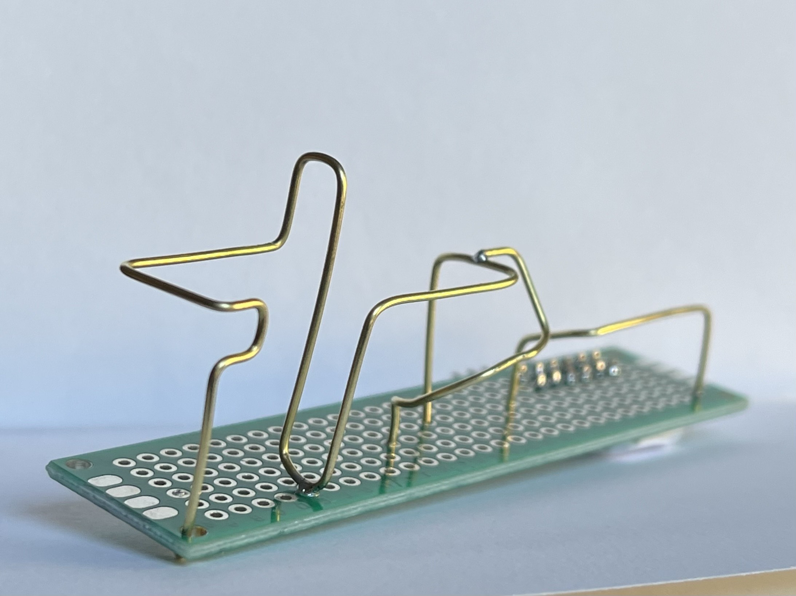
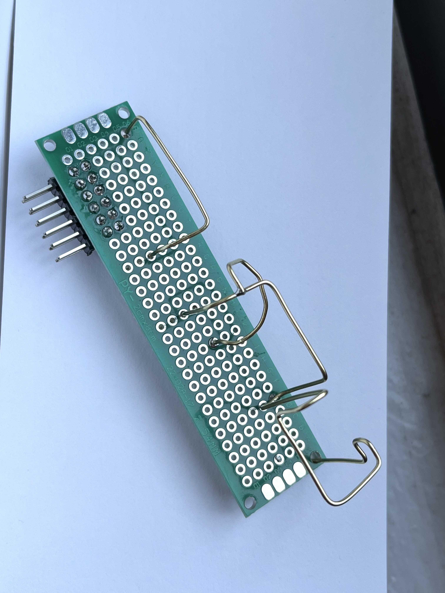

# Generative Art
Generative art on ESP32 with TT-GO display
 
 

 

My piece displays a simple sentence over and over again: “Once upon a time I walked into the forest and saw the tiny people”. This sentence was the first thing that came to my head and I started with it for the purposes of testing my code. I decided to stay with the sentence once I felt that it had become too linked to my project already. I think this decision also reinforces the principle of my piece that the focus is not the content of the sentence but the manner in which it is emitted.
 
 

My first decision was that I wanted to tell a story, imagining a viewer absorbed in the tiny hanging screen, waiting for the story to unfold. Then the concept came immediately from that idea.  
My piece randomly chunks the words of a sentence and displays them for random intervals of time, adjusting the size of the words to fit the screen. This creates novel emphasis and phrasing that changes the interpretation of the sentence every time. Because the emphasis is on the storytelling, I wanted the display itself to look simple on principle. I also don’t want to visually distract the viewer from the transmission of the words being voiced through their head as they are printed.  
I used two hanging attachment points to limit spinning so my screen could be as readable as possible.

 
 
Click to see the art play through!
 
 

 
 
# PCB Fish Pendant
Flashing LED circuit on Printed Circuit Board
 
 

 
 
My biggest decision was what the outline would be. I wanted something with a simple recognizable silhouette. A fish came to mind at the last minute and I drew the outline myself on KiCad. I wanted to make use of the blinking light and integrate it into the shape so I made it the eye of the fish. Because of the layout of my circuit I was able to do that.
 
 

 
 
I imagined my fish hanging on the wall of my bedroom in darkness, like the deep ocean. Something quiet and calm. So I wanted a slower blink to go along with that. Something to let you know the fish was alive.
 
 

 
 
# Riverside
Soldering exercise. 12 pins and copper wire sculpture on protoboard.

I began this sculpture with no intention of what it was going to be. But as I made the first two bends starting from the corner of the board, I was reminded of the shape of my grandparents old house. So I continued, imagining and forming the contours of the building. Even though the wire creates only a skeleton of the house, I see the essence of the house in my sculpture. 

 

